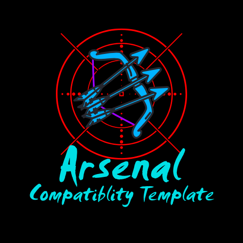

# Arsenal Compatibility Template
A mod meant for testing to see if something is compatible with doctor4t (RAT)'s "Arsenal" mod.

## Required Notices

> [!IMPORTANT]
> Required Notice:
> 
> ["Arsenal"](https://modrinth.com/mod/arsenal) IS A MODIFICATION (MOD) CREATD BY ["doctor4t"](https://www.youtube.com/@doctor4t) ALSO KNOWN AS ["RAT"](https://modrinth.com/user/RAT). NO RIGHTS TO SAID MODIFICATION ARE CLAIMED BY THE TEMPLATE CREATOR ["ExoticDarknessGaming"](https://www.youtube.com/@ExoticDarknessGaming) OR THE PUBLISHER OF THIS MODIFICATION.

> [!IMPORTANT]
> Required Notice:
> 
> Template ["Arsenal Compatibility Template"](https://github.com/ExoticDG/Arsenal_Compatibility_Template) was used in the makeing of this mod. The template was created by [ExoticDarknessGaming](https://www.youtube.com/@ExoticDarknessGaming). I <the dev> of this mod claim no rights to the content taken from the template.
